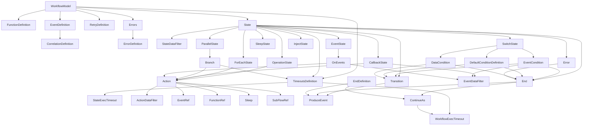

```mermaid
  graph TD;
      WorkflowModel-->FunctionDefinition;
      WorkflowModel-->EventDefinition;
      WorkflowModel-->RetryDefinition;
      WorkflowModel-->TimeoutsDefinition;
      WorkflowModel-->Errors;
      WorkflowModel-->State;
      
      EventDefinition-->CorrelationDefinition;
      
      TimeoutsDefinition-->StateExecTimeout;
      TimeoutsDefinition-->WorkflowExecTimeout;
      
      Errors-->ErrorDefinition;
      
      State-->End;
      State-->Error;
      State-->StateDataFilter
      State-->TimeoutsDefinition;
      State-->Transition;
      
      State-->EventState;
      State-->OperationState;
      State-->SwitchState;
      State-->SleepState;
      State-->ParallelState;
      State-->InjectState;
      State-->ForEachState;
      State-->CallbackState;
      
      EventState-->OnEvents;
      
      OperationState-->Action;
      
      SwitchState-->DataCondition;
      SwitchState-->DefaultConditionDefinition;
      SwitchState-->EventCondition;
      
      ParallelState-->Branch;
      
      ForEachState-->Action;
      
      CallbackState-->Action;
      CallbackState-->EventDataFilter;
      
      Branch-->Action;
      Branch-->TimeoutsDefinition;
      
      EventCondition-->End;
      EventCondition-->EventDataFilter;
      EventCondition-->Transition;
      
      DefaultConditionDefinition-->End;
      DefaultConditionDefinition-->Transition;
      
      DataCondition-->End;
      DataCondition-->Transition;
      
      OnEvents-->Action;
      OnEvents-->EventDataFilter
      
      Action-->ActionDataFilter;
      Action-->EventRef;
      Action-->FunctionRef;
      Action-->Sleep;
      Action-->SubFlowRef;
      
      Transition-->ProduceEvent;
      
      Error-->End;
      
      End-->ContinueAs;
      End-->ProduceEvent;
      
      EndDefinition-->ProduceEvent;
      EndDefinition-->ContinueAs;
      
      ContinueAs-->WorkflowExecTimeout;
```