# Diagrams

## Full Diagram

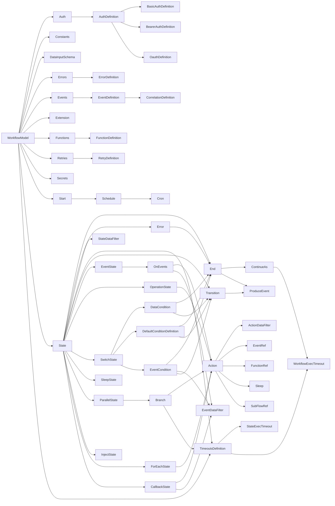

## WorkflowModel

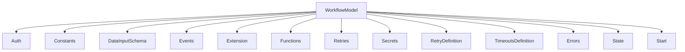

## ParallelState
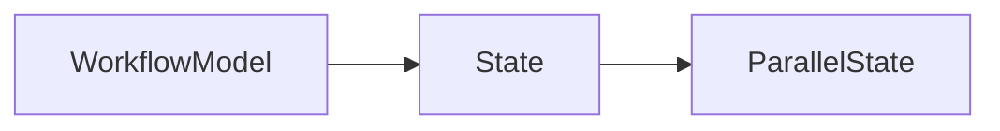

## DataCondition

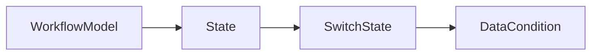

## Branch
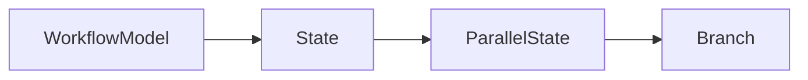

## OnEvents
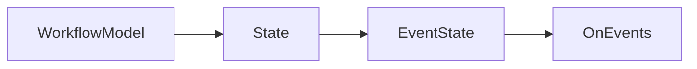

## Action

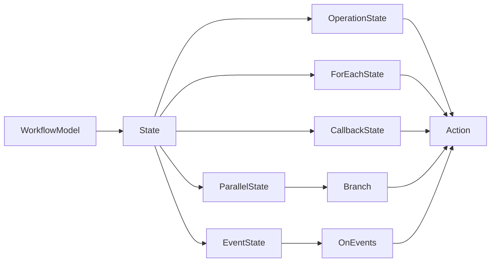

## EventCondition
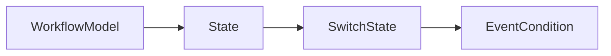

## DefaultConditionDefinition
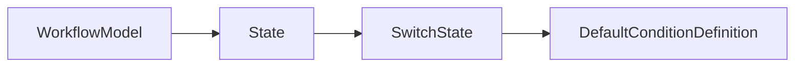

## Transition
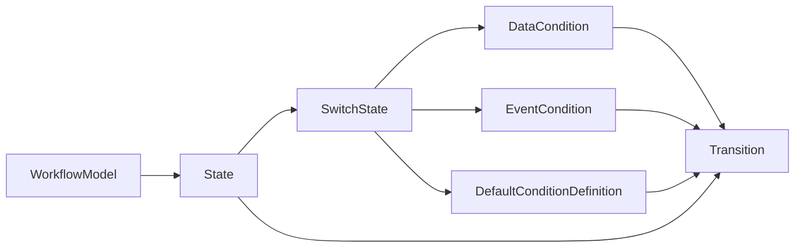

## EventRef
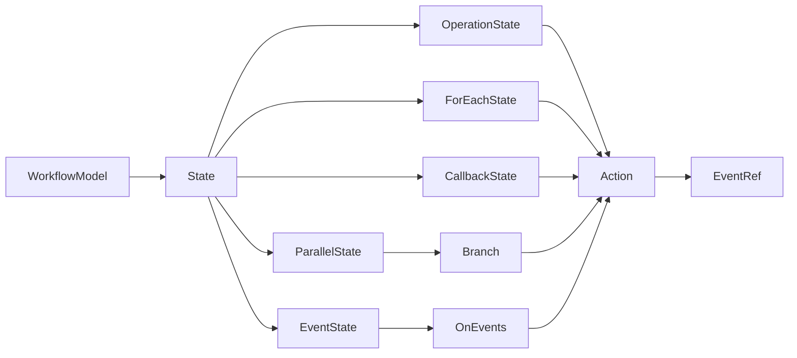

## Error
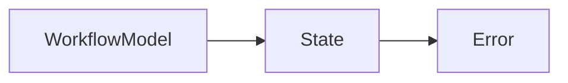

## End
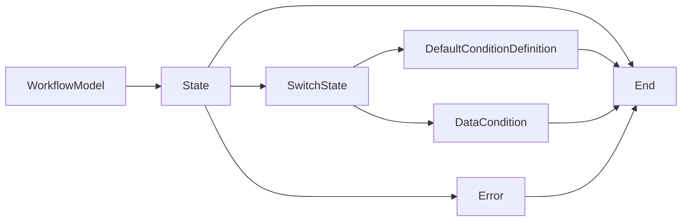

## ProduceEvent
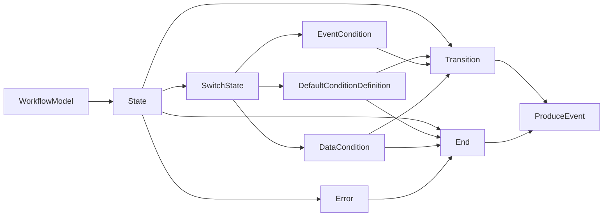

## FunctionRef
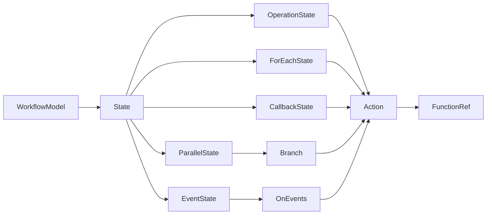